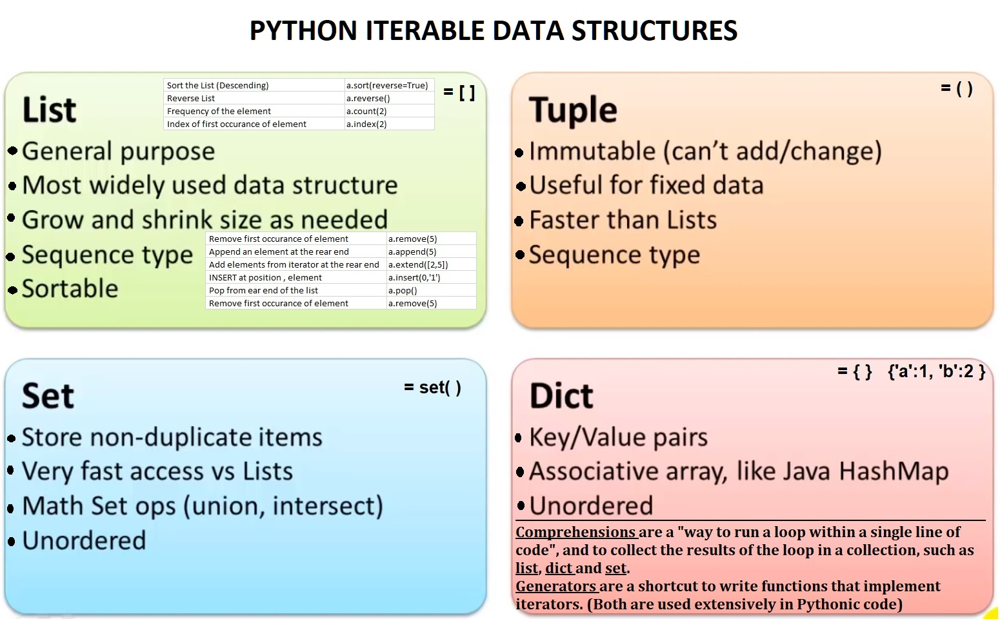

These files I created while watching python Tutorials

Most used Python Data Structures:

Basic but good :
https://www.udemy.com/course/learn-python-3-from-beginner-to-advanced/

Cory Schafer (Best so far):
https://www.youtube.com/watch?v=YYXdXT2l-Gg&list=PL-osiE80TeTskrapNbzXhwoFUiLCjGgY7

My Misc Picks.
https://www.youtube.com/watch?v=k9TUPpGqYTo&list=PLBcG4_ZAU0vNTP1q-VrFmJB3QNDSsApey

Ned Batchelder (Excellent for nice intricate details)

Loop like a native: while, for, iterators, generators: https://www.youtube.com/watch?v=EnSu9hHGq5o

Facts and Myths about Python names and values - PyCon 2015: https://www.youtube.com/watch?v=_AEJHKGk9ns

Raymond Hettinger: Transforming Code into Beautiful, Idiomatic Python: https://www.youtube.com/watch?v=OSGv2VnC0go

Others: (Not so important)

James Powell (Mostly OO Python):
https://www.youtube.com/watch?v=cKPlPJyQrt4&list=PLJsotIV0ZEQDpIIKhT-33qU1WEefRRrBL

Python GUI with Tkinter:
https://www.youtube.com/watch?v=RJB1Ek2Ko_Y&list=PL6gx4Cwl9DGBwibXFtPtflztSNPGuIB_d

